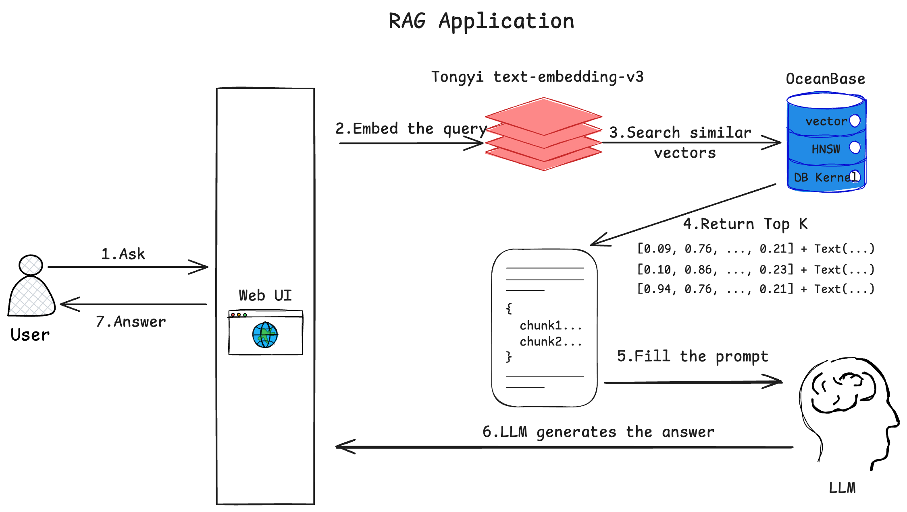
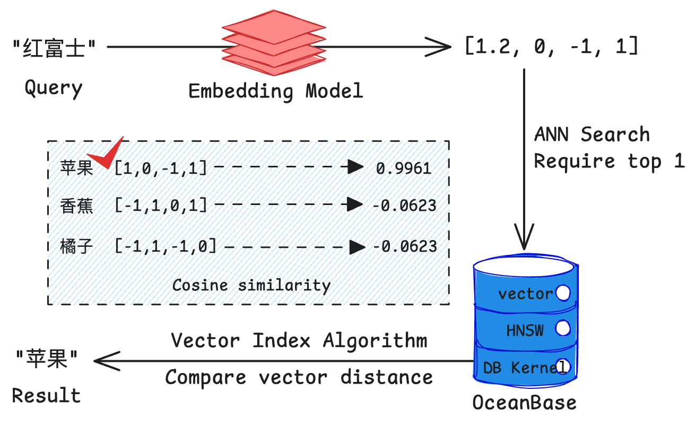

# OceanBase AI 动手实战营

[英文版](./README.md)

## 项目介绍

在这个动手实战营中，我们会构建一个 RAG 聊天机器人，用来回答与 OceanBase 文档相关的问题。它将采用开源的 OceanBase 文档仓库作为多模数据源，把文档转换为向量和结构化数据存储在 OceanBase 中。用户提问时，该机器人将用户的问题同样转换为向量之后在数据库中进行向量检索，结合向量检索得到的文档内容，借助通义千问提供的大语言模型能力来为用户提供更加准确的回答。

### 项目组成

该机器人将由以下几个组件组成：

1. 将文档转换为向量的文本嵌入服务，在这里我们使用通义千问的嵌入 API
2. 提供存储和查询文档向量和其他结构化数据能力的数据库，我们使用 OceanBase 4.3.3 版本
3. 若干分析用户问题、基于检索到的文档和用户问题生成回答的 LLM 智能体，利用通义千问的大模型能力构建
4. 机器人与用户交互的聊天界面，采用 Streamlit 搭建

### 交互流程



1. 用户在 Web 界面中输入想要咨询的问题并发送给机器人
2. 机器人将用户提出的问题使用文本嵌入模型转换为向量
3. 将用户提问转换而来的向量作为输入在 OceanBase 中检索最相似的向量
4. OceanBase 返回最相似的一些向量和对应的文档内容
5. 机器人将用户的问题和查询到的文档一起发送给大语言模型并请它生成问题的回答
6. 大语言模型分片地、流式地将答案返回给机器人
7. 机器人将接收到的答案也分片地、流式地显示在 Web 界面中，完成一轮问答

## 概念解析

### 什么是文本嵌入?

文本嵌入是一种将文本转换为数值向量的技术。这些向量能够捕捉文本的语义信息，使计算机可以"理解"和处理文本的含义。具体来说:

- 文本嵌入将词语或句子映射到高维向量空间中的点
- 在这个向量空间中，语义相似的文本会被映射到相近的位置
- 向量通常由数百个数字组成(如 512 维、1024 维等)
- 可以用数学方法(如余弦相似度)计算向量之间的相似度
- 常见的文本嵌入模型包括 Word2Vec、BERT、BGE 等

在本项目中，我们使用通义千问的文本嵌入模型来生成文档的向量表示，这些向量将被存储在 OceanBase 数据库中用于后续的相似度检索。

例如使用嵌入模型将“苹果”、“香蕉”和“橘子”分别转换为 4 维的向量，它们的向量表示可能如下图所示，需要注意的是我们为了方便表示，将向量的维度降低到了 4 维，实际上文本嵌入产生的向量维数通常是几百或者几千维，例如我们使用的通义千问 text-embedding-v3 产生的向量维度是 1024 维。


### 什么是向量检索?

向量检索是在向量数据库中快速找到与查询向量最相似的向量的技术。其核心特点包括:

- 基于向量间的距离（如欧氏距离）或相似度（如余弦相似度）进行搜索
- 通常使用近似最近邻（Approximate Nearest Neighbor, ANN）算法来提高检索效率
- 常见的 ANN 算法包括 HNSW、IVF 等，OceanBase 4.3.3 支持 HNSW 算法
- 可以快速从百万甚至亿级别的向量中找到最相似的结果
- 相比传统关键词搜索，向量检索能更好地理解语义相似性

OceanBase 在关系型数据库模型基础上将“向量”作为一种数据类型进行了完好的支持，使得在 OceanBase 一款数据库中能够同时针对向量数据和常规的结构化数据进行高效的存储和检索。在本项目中，我们会使用OceanBase 建立 HNSW (Hierarchical Navigable Small World) 向量索引来实现高效的向量检索，帮助我们快速找到与用户问题最相关的文档片段。

如果我们在已经嵌入“苹果”、“香蕉”和“橘子”的 OceanBase 数据库中使用“红富士”作为查询文本，那么我们可能会得到如下的结果，其中“苹果”和“红富士”之间的相似度最高。（假设我们使用余弦相似度作为相似度度量）



### 什么是 RAG?

RAG (Retrieval-Augmented Generation，检索增强生成) 是一种结合检索系统和生成式 AI 的混合架构，用于提高 AI 回答的准确性和可靠性。其工作流程为:

1. 检索阶段:

- 将用户问题转换为向量
- 在知识库中检索相关文档
- 选择最相关的文档片段

2. 生成阶段:

- 将检索到的文档作为上下文提供给大语言模型
- 大语言模型基于问题和上下文生成回答
- 确保回答的内容来源可追溯

RAG 的主要优势有：

- 降低大语言模型的幻觉问题
- 能够利用最新的知识和专业领域信息
- 提供可验证和可追溯的答案
- 适合构建特定领域的问答系统

大语言模型的训练和发布需要耗费较长的时间，且训练数据在开启训练之后便停止了更新。而现实世界的信息熵增无时无刻不在持续，要让大语言模型在“昏迷”几个月之后还能自发地掌握当下最新的信息显然是不现实的。而 RAG 就是让大模型用上了“搜索引擎”，在回答问题前先获取新的知识输入，这样通常能较大幅度地提高生成回答的准确性。

## 准备工作

注意：如果您正在参加 OceanBase AI 动手实战营，您可以跳过以下步骤 1 ~ 4。所有所需的软件都已经在机器上准备好了。:)

1. 安装 [Python 3.9+](https://www.python.org/downloads/) 和 [pip](https://pip.pypa.io/en/stable/installation/)

2. 安装 [Poetry](https://python-poetry.org/docs/)，可参考命令 `python3 -m pip install poetry`

3. 安装 [Docker](https://docs.docker.com/engine/install/)

4. 安装 MySQL 客户端，可参考 `yum install -y mysql` 或者 `apt-get install -y mysql-client`

5. 确保您机器上该项目的代码是最新的状态，建议进入项目目录执行 `git pull`

6. 注册[阿里云百炼](https://bailian.console.aliyun.com/)账号并获取 API Key


## 构建聊天机器人

### 1. 部署 OceanBase 集群

#### 1.1 启动 OceanBase docker 容器

如果你是第一次登录动手实战营提供的机器，你需要通过以下命令启动 Docker 服务：

```bash
systemctl start docker
```

随后您可以使用以下命令启动一个 OceanBase docker 容器：

```bash
docker run --name=ob433 -e MODE=mini -e OB_MEMORY_LIMIT=8G -e OB_DATAFILE_SIZE=10G -e OB_CLUSTER_NAME=ailab2024 -p 127.0.0.1:2881:2881 -d quay.io/oceanbase/oceanbase-ce:4.3.3.1-101000012024102216
```

如果上述命令执行成功，将会打印容器 ID，如下所示：

```bash
af5b32e79dc2a862b5574d05a18c1b240dc5923f04435a0e0ec41d70d91a20ee
```

#### 1.2 检查 OceanBase 初始化是否完成

容器启动后，您可以使用以下命令检查 OceanBase 数据库初始化状态：

```bash
docker logs -f ob433
```

初始化过程大约需要 2 ~ 3 分钟。当您看到以下消息（底部的 `boot success!` 是必须的）时，说明 OceanBase 数据库初始化完成：

```bash
cluster scenario: express_oltp
Start observer ok
observer program health check ok
Connect to observer ok
Initialize oceanbase-ce ok
Wait for observer init ok
+----------------------------------------------+
|                 oceanbase-ce                 |
+------------+---------+------+-------+--------+
| ip         | version | port | zone  | status |
+------------+---------+------+-------+--------+
| 172.17.0.2 | 4.3.3.1 | 2881 | zone1 | ACTIVE |
+------------+---------+------+-------+--------+
obclient -h172.17.0.2 -P2881 -uroot -Doceanbase -A

cluster unique id: c17ea619-5a3e-5656-be07-00022aa5b154-19298807cfb-00030304

obcluster running

...

check tenant connectable
tenant is connectable
boot success!
```

使用 `Ctrl + C` 退出日志查看界面。

#### 1.3 测试数据库部署情况（可选）

可以使用 mysql 客户端连接到 OceanBase 集群，检查数据库部署情况。

```bash
mysql -h127.0.0.1 -P2881 -uroot@test -A -e "show databases"
```

如果部署成功，您将看到以下输出：

```bash
+--------------------+
| Database           |
+--------------------+
| information_schema |
| mysql              |
| oceanbase          |
| test               |
+--------------------+
```

### 2. 安装依赖

接下来，您需要切换到动手实战营的项目目录：

```bash
cd ~/ai-workshop-2024
```

我们使用 Poetry 来管理聊天机器人项目的依赖项。您可以使用以下命令安装依赖项：

```bash
poetry install
```

如果您正在使用动手实战营提供的机器，您会看到以下消息，因为依赖都已经预先安装在了机器上：

```bash
Installing dependencies from lock file

No dependencies to install or update
```

### 3. 设置环境变量

我们准备了一个 `.env.example` 文件，其中包含了聊天机器人所需的环境变量。您可以将 `.env.example` 文件复制到 `.env` 并更新 `.env` 文件中的值。

```bash
cp .env.example .env
# 更新 .env 文件中的值，特别是 API_KEY 和数据库连接信息
vi .env
```

`.env.example` 文件的内容如下，如果您正在按照动手实战营的步骤进行操作（使用通义千问提供的 LLM 能力），您只需要更新 `API_KEY` 为您从阿里云百炼控制台获取的值，其他值可以保留为默认值。

```bash
API_KEY=xxxxxxxxxxxxxxxxxxxxxxxxxxxxxxxx # 填写 API Key
LLM_MODEL="qwen-turbo-2024-11-01"
LLM_BASE_URL="https://dashscope.aliyuncs.com/compatible-mode/v1"

HF_ENDPOINT=https://hf-mirror.com
BGE_MODEL_PATH=BAAI/bge-m3

OLLAMA_URL=
OLLAMA_TOKEN=

OPENAI_EMBEDDING_API_KEY= # 填写 API Key
OPENAI_EMBEDDING_BASE_URL="https://dashscope.aliyuncs.com/compatible-mode/v1"
OPENAI_EMBEDDING_MODEL=text-embedding-v3

DB_HOST="127.0.0.1"
DB_PORT="2881"
DB_USER="root@test"
DB_NAME="" # 填写你的数据库名
DB_PASSWORD=""

UI_LANG="zh"
```

### 4. 创建数据库

您可使用我们准备好的创建数据库的脚本来完成快速创建，可参考如下命令:

```bash
bash utils/create_db.sh
# 如果有如下输出说明数据库创建完成
# Database xxx created successfully
```

可通过另外一个脚本来尝试连接数据库，以确保数据库创建成功：

```bash
bash utils/connect_db.sh
# 如果顺利进入 MySQL 连接当中，则验证了数据库创建成功
```

### 5. 准备文档数据

#### 5.1 下载预处理数据并加载（速度快，仅限动手实战营活动中使用）

在这一步中，我们将加载预处理的文档数据到 OceanBase 数据库中。

```bash
# 加载预处理的文档数据
poetry run python utils/load.py --source_file ~/data.json
```

加载数据大约需要 2 分钟。您将看到以下输出：（SAWarnings 可以忽略）

```bash
args Namespace(table_name='corpus', source_file='/root/data.json', skip_create=False, insert_batch=100)
  0%|                                                                                                                                                                                                                                                          | 0/27412 [00:00<?, ?it/s]
/root/.cache/pypoetry/virtualenvs/ai-workshop-aLQYZfdO-py3.10/lib/python3.10/site-packages/pyobvector/client/ob_vec_client.py:329: SAWarning: Unknown schema content: '  VECTOR KEY `vidx` (`embedding`) WITH (DISTANCE=L2,M=16,EF_CONSTRUCTION=256,LIB=VSAG,TYPE=HNSW, EF_SEARCH=64) BLOCK_SIZE 16384'
  table = Table(table_name, self.metadata_obj, autoload_with=self.engine)
100%|██████████████████████████████████████████████████████████████████| 27412/27412 [01:44<00:00, 262.02it/s]
```

注意：`data.json` 文件是一个预处理的文档数据文件，包含文档的向量数据和元数据。它是由步骤 5.2 处理得到、并通过执行 `utils/extract.py` 脚本提取出来的。如果您不想使用预处理数据而是打算自己嵌入文档并插入数据库，请转到步骤 5.2。

#### 5.2 克隆文档仓库并处理（速度慢）

注意：步骤 5.2 在 CPU 机器上通常要花费几个小时甚至更长的时间。

在该步骤中，我们将克隆 OceanBase 开源文档仓库并处理它们，生成文档的向量数据和其他结构化数据后将数据插入到我们在步骤 1 部署好的 OceanBase 数据库中。

```bash
cd doc_repos
git clone --single-branch --branch V4.3.3 https://github.com/oceanbase/oceanbase-doc.git
git clone --single-branch --branch V4.3.0 https://github.com/oceanbase/ocp-doc.git
git clone --single-branch --branch V4.3.1 https://github.com/oceanbase/odc-doc.git
git clone --single-branch --branch V4.2.5 https://github.com/oceanbase/oms-doc.git
git clone --single-branch --branch V2.10.0 https://github.com/oceanbase/obd-doc.git
git clone --single-branch --branch V4.3.0 https://github.com/oceanbase/oceanbase-proxy-doc.git
cd ..
```

```bash
# 把文档的标题转换为标准的 markdown 格式
poetry run python convert_headings.py \
  doc_repos/oceanbase-doc/zh-CN \
  doc_repos/ocp-doc/zh-CN \
  doc_repos/odc-doc/zh-CN \
  doc_repos/oms-doc/zh-CN \
  doc_repos/obd-doc/zh-CN \
  doc_repos/oceanbase-proxy-doc/zh-CN

# 生成文档向量和元数据
poetry run python embed_docs.py --doc_base doc_repos/oceanbase-doc/zh-CN
poetry run python embed_docs.py --doc_base doc_repos/ocp-doc/zh-CN --component ocp
poetry run python embed_docs.py --doc_base doc_repos/odc-doc/zh-CN --component odc
poetry run python embed_docs.py --doc_base doc_repos/oms-doc/zh-CN --component oms
poetry run python embed_docs.py --doc_base doc_repos/obd-doc/zh-CN --component obd
poetry run python embed_docs.py --doc_base doc_repos/oceanbase-proxy-doc/zh-CN --component odp
```

如果你想要将上述步骤生成并插入到数据库中的数据提取出来保存在 `my-data.json` 的文件中，可以执行以下命令：

```bash
poetry run python utils/extract.py --output_file ~/my-data.json
```

这就是我们获取预处理数据 `data.json` 的方法。

### 6. 启动聊天界面

执行以下命令启动聊天界面：

```bash
poetry run streamlit run --server.runOnSave false chat_ui.py
```

访问终端中显示的 URL 来打开聊天机器人应用界面。

```bash
  You can now view your Streamlit app in your browser.

  Local URL: http://localhost:8501
  Network URL: http://172.xxx.xxx.xxx:8501
  External URL: http://xxx.xxx.xxx.xxx:8501 # 这是您可以从浏览器访问的 URL
```


## FAQ

### 1. 如何更改用于生成回答的 LLM 模型？

您可以通过更新 `.env` 文件中的 `LLM_MODEL` 环境变量来更改 LLM 模型。默认值是 `glm-4-flash`，这是智谱 AI 提供的免费模型。还有其他可用的模型，如 `glm-4-air`、`glm-4-plus`、`glm-4-long` 等。您可以在[智谱 AI 网站](https://open.bigmodel.cn) 上找到完整的模型列表。

### 2. 是否可以在初始加载后更新文档数据？

当然可以。您可以通过运行 `embed_docs.py` 脚本插入新的文档数据。例如：

```bash
# 这将在当前目录中嵌入所有 markdown 文件，其中包含 README.md 和 LEGAL.md
poetry run python embed_docs.py --doc_base .

# 或者您可以指定要插入数据的表
poetry run python embed_docs.py --doc_base . --table_name my_table
```

然后您可以在启动聊天界面之前指定 `TABLE_NAME` 环境变量，来指定聊天机器人将查询哪张表：

```bash
TABLE_NAME=my_table poetry run streamlit run --server.runOnSave false chat_ui.py
```

### 3. 如何知道嵌入和检索过程中数据库执行的操作？

当您自己插入文档时，可以设置 `--echo` 标志来查看脚本执行的 SQL 语句，如下所示：

```bash
poetry run python embed_docs.py --doc_base . --table_name my_table --echo
```

您将看到以下输出：

```bash
2024-10-16 03:17:13,439 INFO sqlalchemy.engine.Engine
CREATE TABLE my_table (
        id VARCHAR(4096) NOT NULL,
        embedding VECTOR(1024),
        document LONGTEXT,
        metadata JSON,
        component_code INTEGER NOT NULL,
        PRIMARY KEY (id, component_code)
)
...
```

您还可以在启动聊天界面之前设置 `ECHO=true`，以查看聊天界面执行的 SQL 语句。

```bash
ECHO=true TABLE_NAME=my_table poetry run streamlit run --server.runOnSave false chat_ui.py
```

### 4. 为什么我在启动 UI 服务后再编辑 .env 文件不再生效？

如果你编辑了 .env 文件或者是代码文件，需要重启 UI 服务才能生效。你可以通过 `Ctrl + C` 终止服务，然后重新运行 `poetry run streamlit run --server.runOnSave false chat_ui.py` 来重启服务。

### 5. 如何更改聊天界面的语言？

你可以通过更新 `.env` 文件中的 `UI_LANG` 环境变量来更改聊天界面的语言。默认值是 `zh`，表示中文。你可以将其更改为 `en` 来切换到英文。更新完成后需要重启服务才能生效。
